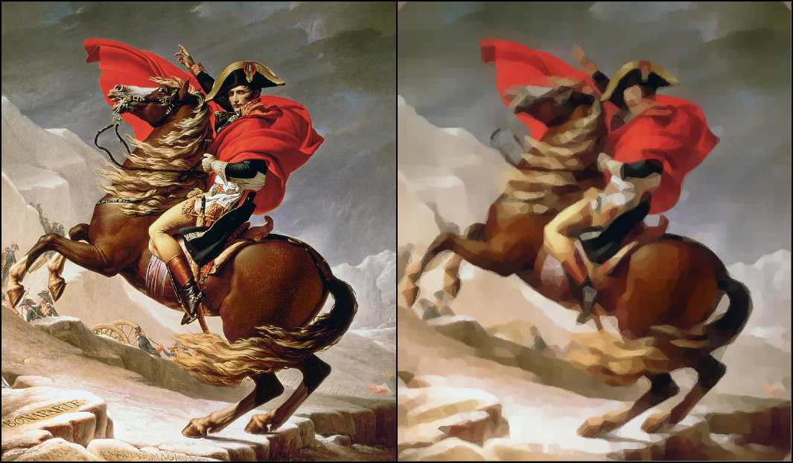
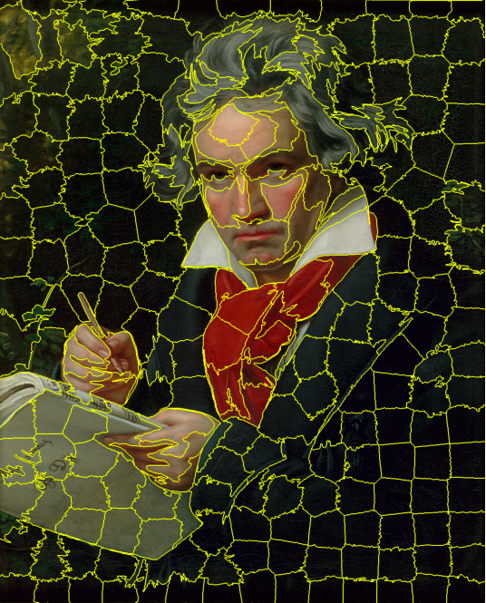
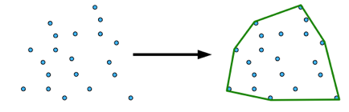
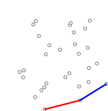
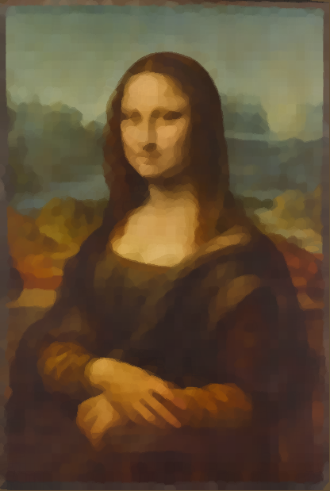

# PolyRender: Generative Polygonal Art

Author: Pedro Alvarado García

---

## Introduction
PolyRender is an image processing tool that uses advanced algorithms to transform images into unique works of art composed of polygons. Through the technique of superpixel segmentation and the creation of convex envelopes, the software visually reinvents the original images, offering a new artistic perspective that is situated at the intersection of technology and digital art.

## Inspiration
This project is inspired by similar works. Below are links to such projects:
1. [Primitive](https://github.com/fogleman/primitive)
2. [Geometrize](https://github.com/Tw1ddle/geometrize)
3. [Genetic-lisa](https://github.com/peterbraden/genetic-lisa)
4. [Evolution of Mona Lisa](https://rogerjohansson.blog/2008/12/07/genetic-programming-evolution-of-mona-lisa/)

## How it works
PolyRender transforms images into unique polygonal artworks. This process involves several key steps, from the initial segmentation of the image to the final creation of polygonal art.

### Step 1: Image Selection and Preparation
Initially, in the program, the user must open an image. Subsequently, for the algorithm to be more efficient, the image is rescaled.

### Step 2: Superpixel Segmentation
A superpixel is a group of adjacent pixels in an image that share characteristics such as color, intensity, or texture. Superpixels are useful because they reduce the complexity of an image, grouping pixels into larger, more manageable units that retain much of the important structural information.

In the implementation, superpixel segmentation is carried out through the SLIC (Simple Linear Iterative Clustering) algorithm.

Simply put, SLIC works by dividing an image into small areas called superpixels. These superpixels are like small puzzle pieces that together form the complete image. SLIC selects initial points in the image and groups nearby pixels that are similar to each other in color and position. Then, it adjusts these groups several times until the superpixels form a clear and efficient representation of the image, ensuring that each puzzle piece fits well with its neighbors. This method is fast and effective, and helps to simplify the image for further analysis.

<figure>
    <figcaption>Example of superpixels of an image after applying SLIC (approximately 250 segments)</figcaption>
</figure>

### Step 3: Creation of Convex Hulls
A convex hull, in simple terms, is like a rubber band stretched to surround a group of objects. Imagine you have several nails in a board and stretch a rubber band to encircle all the nails. The shape the rubber band takes represents the convex hull of the nails.

The library used to implement the generation of convex hulls uses the Graham Scan algorithm.

In our particular case, each group of objects will be the superpixels. Each of the superpixels obtained with SLIC are potential polygons. For each superpixel, a convex hull is generated that encloses all the points of the superpixel.

The points of each convex hull will be the points of the polygons.

<figure>
    <figcaption>Example of convex hulls. Each convex hull represents a superpixel and encloses all the points of that superpixel</figcaption>
</figure>

### Step 4: Polygon Rendering
Once we have the convex hulls and therefore, the polygons, we proceed to render each polygon. The points of the polygons are given by the points of the convex hull, and the color of the polygon is determined by the average color of the pixels of the superpixel associated with that polygon and its convex hull.

### Instalation

Prerequisites: Have the JRE (Java Runtime Environment) and python3 installed.

1. Download the polyrender.jar executable
2. Download main.py and the requirements.txt file.
3. Preferably create a virtual python environment to download the libraries that contain requirements.txt.
4. For the Java application to work you must previously be running the Python application. To do this just run the python program with `python3 main.py` (make sure the virtual environment is turned on and the libraries are downloaded).

### Examples

